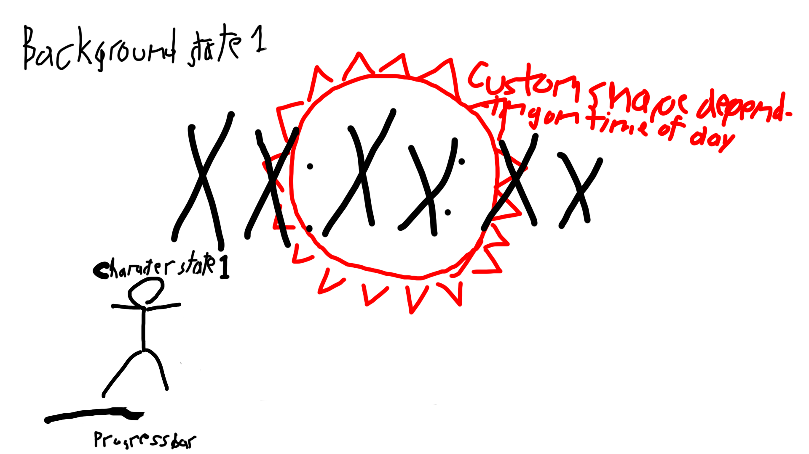
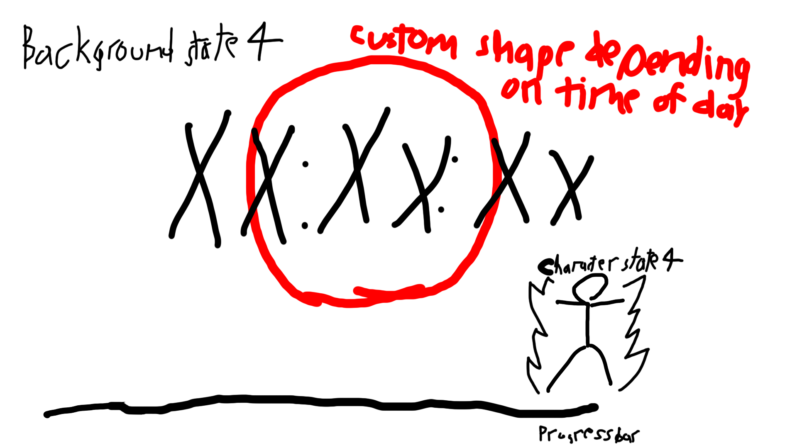
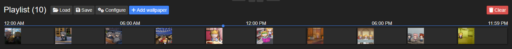

## 1. As someone who has grown up knowing how mcuh a character can mean to a person, as well as how customizable  one can make the software that they use every day, allowing them to even theme their wallpapers after a specific theme, I thought that it would be interesting to have an in-browser clock that changes with the time of day. Several elemnts will change over time along with the clock itself, such as the character that the clock is themed after, which will hopefully change it's horizontal position over time, a progress bar at the bottom, which will show how complete/incomplete the day is, a custom-made icon below the clock that will ad some visual flair, and possibly be animated, as well as the background, which will change depending on the character's state.

## 2. Sketches

## 3. References

[Site Layout Inspiration](http://www.mrfastforward.com/site/Home.html)